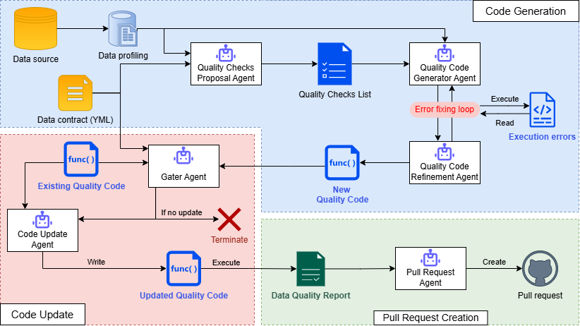

# 🤖 Agent-Assisted Data QA (Human-in-the-Loop)

This project helps you automatically generate data quality code using an agent-based system, with optional human-in-the-loop review via GitHub pull requests.



## 📦 Project Structure

This repository contains two main parts:

- **Agentic system**  
  A Python package that runs the data QA pipeline.

- **Case studies (`case_studies/`)**  
  Includes:
  - Data contracts (`.yaml`)
  - Database schemas
  - Example datasets to reproduce results

---

## 🚀 Quick Start

### 1. Build and Install the Package

```bash
python -m build
pip install ./dist/qa_agent-0.1.0-py3-none-any.whl --force-reinstall
````

---

### 2. Set Up Environment Variables

Create a `.env` file in the project root based on the following template:

```env
GITHUB_APP_ID=
GITHUB_INSTALLATION_ID=
GITHUB_PRIVATE_KEY_PATH=
GITHUB_CLIENT_SECRET=
OPENAI_API_KEY=
```

### 🔑 How to Get These Values

#### GitHub App Credentials

You’ll need to create a GitHub App to allow the agent to open pull requests.

1. Go to: [https://github.com/settings/apps](https://github.com/settings/apps)
2. Click **“New GitHub App”**

Fill in:

* **App name**: anything (e.g., `qa-agent`)
* **Homepage URL**: your repo URL
* **Permissions**:

  * Contents → Read & Write
  * Pull requests → Read & Write

After creating the app:

* **GITHUB_APP_ID**
  → Found on the GitHub App settings page

* **GITHUB_CLIENT_SECRET**
  → Generate under *Client secrets*

* **GITHUB_PRIVATE_KEY_PATH**
  → Generate a private key and save the `.pem` file locally
  → Set this to the file path (e.g., `./private-key.pem`)

---

#### GitHub Installation ID

1. Install your GitHub App on your repository
2. After installation, visit:

   ```
   https://github.com/settings/installations
   ```
3. Click your app → copy the **Installation ID** from the URL

Set it as:

```env
GITHUB_INSTALLATION_ID=12345678
```

---

#### OpenAI API Key

1. Go to: [https://platform.openai.com/api-keys](https://platform.openai.com/api-keys)
2. Create a new API key
3. Paste it into:

```env
OPENAI_API_KEY=your_key_here
```

---

### 3. Start the Database

Navigate to the case studies folder:

```bash
cd case_studies
```

Start MySQL with Docker:

```bash
docker compose up -d
```

This will spin up the database and populate it with sample data.

---

### 4. Run the QA Agent

```bash
qa_agent \
  --owner <GITHUB_USERNAME> \
  --repo <GITHUB_REPO> \
  --dataset <dataset_name> \
  --output_path expectations/<dataset_name>_suite.py \
  --contract contracts/contract.<dataset_name>.yaml \
  --mode single
```

---

## ⚙️ Parameters

* `--owner` → GitHub username or organization

* `--repo` → Repository name

* `--dataset` → One of:

  * `billing`
  * `bsad`
  * `raddb`

* `--output_path` → Where generated expectations will be saved

* `--contract` → Path to the dataset contract file

* `--mode`:

  * `single` → Single-agent mode
  * *(omit)* → Multi-agent mode

---

## 📤 What Happens Next?

The pipeline will:

1. Collect and analyze your dataset
2. Generate data quality expectations
3. Create a pull request in your repository

You can then review, modify, and approve the generated tests.
