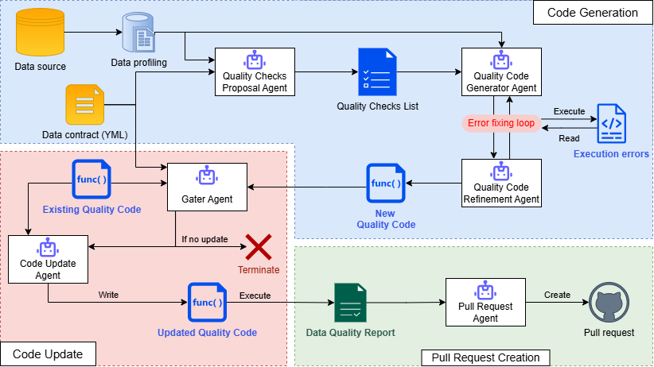

# Agent-Assisted Data QA (Human-in-the-Loop)

An agentic pipeline that generates [Great Expectations](https://greatexpectations.io/) data quality suites from [Open Data Contract Standard](https://bitol-io.github.io/open-data-contract-standard/) contracts, then opens a draft pull request for human review.



---

## Pipeline Architecture

```
Data Contract (YAML)
        │
        ▼
┌──────────────────┐
│  Stage 0         │  Sampler: query DB → Parquet + profile JSON
│  Sampling        │
└────────┬─────────┘
         │
         ▼
┌──────────────────┐
│  Stage 1         │  datacontract CLI → GX suite JSON
│  CLI Export      │  (structural checks only)
└────────┬─────────┘
         │
         ▼
┌──────────────────┐
│  Stage 2         │  Gap classifier: find rules the CLI missed
│  Gap Analysis    │
└────────┬─────────┘
         │  (if gaps exist)
         ▼
┌──────────────────┐
│  Stage 3         │  LLM coder → append expectations to suite
│  LLM Generation  │  (with self-healing retry loop)
└────────┬─────────┘
         │
         ▼
┌──────────────────┐
│  Stage 4         │  GX validation on sample → report + GitHub PR
│  Validate & PR   │
└──────────────────┘
```

**Stage 0 — Sampling** connects to the MySQL database declared in the contract's `servers` block and queries up to 100 rows per table. Results are written as Parquet files under `artifacts/samples/`. A column-level profile (null rate, distinct ratio, numeric percentiles) is saved to `artifacts/profiles/` and fed to the LLM as context.

**Stage 1 — CLI Export** invokes the `datacontract` CLI against the contract YAML to generate a GX suite JSON. The CLI handles only rules structurally encoded in field properties (`required`, `unique`, `minimum`/`maximum`, `enum`, `pattern`). It cannot express `text`, `sql`, or `custom` quality blocks, freshness SLAs, or referential integrity rules.

**Stage 2 — Gap Analysis** parses the generated suite to determine which `(field, check_type)` pairs are already covered, then emits an `unresolved` list for everything the CLI missed. Each unresolved item is serialised as a YAML fragment that becomes the LLM prompt input.

**Stage 3 — LLM Generation** receives the unresolved rules and schema metadata. It appends expectations to the existing suite and tags each one with `meta={"check_id": "<model>:<check_type>:<field>"}`. A self-healing retry loop (up to 5 attempts) feeds Python tracebacks back to the LLM to fix execution errors.

**Stage 4 — Validation & PR** validates all table samples against the GX suite, writes the full report to `artifacts/sandbox/{dataset}.{run_id}.report.json`, commits the results to a `bot/{run_id}` branch, and opens a draft GitHub PR.

---

## Worked Example (raddb)

### Stage 1 — What the CLI can generate

Given this contract snippet:

```yaml
models:
  radacct:
    fields:
      radacctid:
        type: integer
        required: true
        unique: true          # ← CLI picks this up

      nasporttype:
        type: string
        quality:
          - type: library
            metric: invalidValues
            arguments:
              validValues: [Virtual, ISDN]   # ← CLI picks this up

      nasportid:
        type: string
        quality:
          - type: text
            description: Must follow format "Uniq-Sess-ID<id>" where <id> are numerics.
            # ← CLI cannot express free-text rules — skipped

      acctsessiontime:
        type: integer
        quality:
          - type: sql
            description: 95% of acctsessiontime should be less than 30000 seconds.
            query: SELECT quantile(acctsessiontime, 0.95) FROM radacct
            # ← CLI cannot express SQL rules — skipped

servicelevels:
  freshness:
    description: Data should be no older than 25 hours.
    timestampField: radacct.acctstarttime
    # ← CLI cannot express freshness SLAs — skipped
```

The CLI produces only the checks it can express structurally:

```json
{ "type": "expect_column_values_to_be_of_type", "kwargs": { "column": "radacctid", "type_": "int32" }, "meta": {} }
{ "type": "expect_column_values_to_be_unique",  "kwargs": { "column": "radacctid" },                  "meta": {} }
{ "type": "expect_column_values_to_be_of_type", "kwargs": { "column": "nasporttype", "type_": "str" }, "meta": {} }
```

`nasporttype`'s domain check, `nasportid`'s format rule, `acctsessiontime`'s percentile rule, and the freshness SLA produce no expectations — they become gaps. Note: the CLI translates `required: true` into a type check, not a null check, so `not_null` for required fields is always a gap passed to the LLM.

### Stage 2 — Gaps passed to the LLM

The gap classifier emits the unresolved items as a pruned YAML fragment:

```yaml
radacct.radacctid:
  not_null: "radacctid is required (primaryKey)"

radacct.nasportid:
  format: 'Must follow format "Uniq-Sess-ID<id>" where <id> are numerics.'

radacct.nasporttype:
  domain: "Ensure nasporttype uses valid port types: [Virtual, ISDN]"

radacct.acctsessiontime:
  range: "95% of acctsessiontime should be less than 30000 seconds."

radacct.acctstarttime:
  freshness: "Data should be no older than 25 hours."
```

The LLM generates GX expectations for each item, tagging every one with a `check_id`:

```json
{ "type": "expect_column_values_to_not_be_null",        "kwargs": { "column": "radacctid" },                                    "meta": { "check_id": "radacct:not_null:radacctid" } }
{ "type": "expect_column_values_to_match_regex",         "kwargs": { "column": "nasportid", "regex": "^Uniq-Sess-ID\\d+$" },    "meta": { "check_id": "radacct:format:nasportid" } }
{ "type": "expect_column_values_to_be_in_set",           "kwargs": { "column": "nasporttype", "value_set": ["Virtual","ISDN"] }, "meta": { "check_id": "radacct:domain:nasporttype" } }
{ "type": "expect_column_quantile_values_to_be_between", "kwargs": { "column": "acctsessiontime", "..." : "..." },               "meta": { "check_id": "radacct:range:acctsessiontime" } }
{ "type": "expect_column_values_to_be_between",          "kwargs": { "column": "acctstarttime", "..." : "..." },                 "meta": { "check_id": "radacct:freshness:acctstarttime" } }
```

---

## Project Structure

```
.
├── src/qa_agent/               # Python package
│   ├── main.py                 # LangGraph pipeline entrypoint + CLI
│   └── langgraph_src/
│       ├── contract_parser.py  # CLI export, coverage diffing, rule extraction
│       ├── sampler.py          # DB sampling and profiling
│       ├── validator.py        # GX validation runner
│       ├── github_utils.py     # GitHub App helpers (branch, commit, PR)
│       ├── prompt.py           # LLM prompt templates
│       └── utils.py            # Code extraction helpers
├── case_studies/
│   ├── contracts/              # Data contracts (billing, bsadb, raddb)
│   ├── docker-compose.yml      # MySQL + data loader
│   └── database/               # SQL dumps and seed data
├── artifacts/                  # Runtime outputs (gitignored)
│   ├── samples/                # Parquet samples per table
│   ├── profiles/               # Column null-rate / distinct-ratio profiles
│   ├── metadata/               # Declared vs observed schema types
│   ├── failing_examples/       # CSV rows that failed validation
│   └── sandbox/                # Full GX validation reports
├── expectations/               # Generated GX suite JSON files
├── gx/                         # Great Expectations file context (auto-created)
├── pyproject.toml
└── requirement.txt
```

---

## Quick Start

### 1. Install the Package

```bash
pip install -r requirement.txt
pip install -e .
```

Or build a wheel:

```bash
python -m build
pip install ./dist/qa_agent-0.1.0-py3-none-any.whl --force-reinstall
```

---

### 2. Set Up Environment Variables

Create a `.env` file in the project root:

```env
# LLM models (any model string accepted by langchain init_chat_model)
CODER_MODEL=gpt-5.2
WRITER_MODEL=gpt-3.5-turbo

# API key for whichever LLM provider you use
OPENAI_API_KEY=

# GitHub App credentials (required for PR creation)
GITHUB_APP_ID=
GITHUB_INSTALLATION_ID=
GITHUB_PRIVATE_KEY_PATH=./private-key.pem
```

#### Creating a GitHub App

1. Go to [https://github.com/settings/apps](https://github.com/settings/apps) and click **New GitHub App**.
2. Set **Permissions**: Contents → Read & Write, Pull requests → Read & Write.
3. After creation, note the **App ID** and generate a **Private Key** (`.pem` file).
4. Install the app on your repository and copy the **Installation ID** from the URL at `https://github.com/settings/installations`.

---

### 3. Start the Database

```bash
cd case_studies
docker compose up -d
```

This starts a MySQL 8.0 container and seeds it with the case study data.

---

### 4. Run the Pipeline

```bash
qa_agent \
  --owner <GITHUB_USERNAME> \
  --repo <GITHUB_REPO> \
  --dataset raddb \
  --output_path expectations/raddb_suite.py \
  --contract case_studies/contracts/contract.raddb.yaml
```

---

## CLI Reference

| Flag | Required | Description |
|---|---|---|
| `--owner` | Yes | GitHub username or organization |
| `--repo` | Yes | Repository name |
| `--dataset` | Yes | Dataset name (`billing`, `bsadb`, `raddb`) |
| `--output_path` | Yes | Path for the generated expectations file |
| `--contract` | Yes | Path to the ODCS data contract YAML |
| `--base_branch` | No | Base branch for the PR (default: `main`) |
| `--run_id` | No | Re-use artifacts from a previous run (skips sampling) |

---

## Data Contracts

Contracts live in `case_studies/contracts/` and follow the Open Data Contract Standard. Database connection details (host, port, credentials) are declared in the `servers.mysql` block of each contract — the sampler reads them directly from there.

Available contracts:

- `contract.billing.yaml`
- `contract.bsadb.yaml`
- `contract.raddb.yaml`

---

## Output

After a successful run:

- `expectations/<dataset>_suite.json` — merged GX expectation suite (CLI + LLM)
- `expectations/<contract>.llm.yaml` — pruned contract fragment sent to the LLM
- `artifacts/sandbox/<dataset>.<run_id>.report.json` — full GX validation report
- `artifacts/failing_examples/<dataset>.<run_id>.csv` — up to 5 rows that failed
- A draft PR is opened on GitHub with an LLM-written summary of the validation results.
